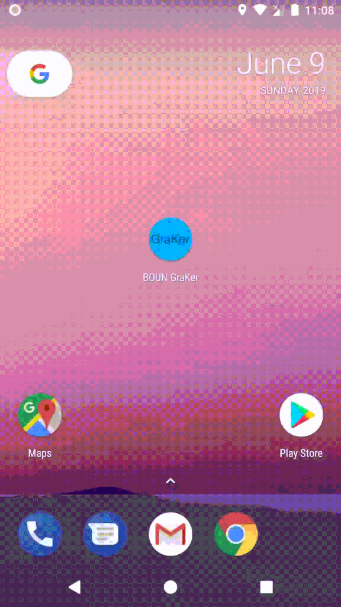

**BOUN GraKer** (**Bo**ğaziçi **Un**iversity **Gra**de Chec**ker**) is a simple Android application
for viewing letter grades of all the courses taken at Boğaziçi University.

It can also check for the grades of the courses taken in the _last_ term (semester) periodically in the background
and notify about new grades.

You can download the APK from [here](apk/boun-graker-signed.apk).

***

### Some Details

- Minimum required Android version is **5.0 (Lollipop)**.
- You need to log into the application with your BUIS/ÖBİKAS credentials.
- Courses are grouped by term. Terms can be selected via a dropdown list. 
Once a term is selected, the information (course grades, SPA and GPA) for that term will be displayed.
- Term information is stored locally (in `SharedPreferences`) once it is retrieved from the server. 
To update the term information manually, you can tap the `UPDATE NOW` button.
- An information of last (successful) check date/time is displayed for each term.
- Background sync service works for only the last term. It is executed at about every 20 minutes. 
(Note that this interval is not strict. Android system determines when to run this service based on some conditions 
such as battery status, device sleep status, etc.)

***

### A Screen Recording of the Application

